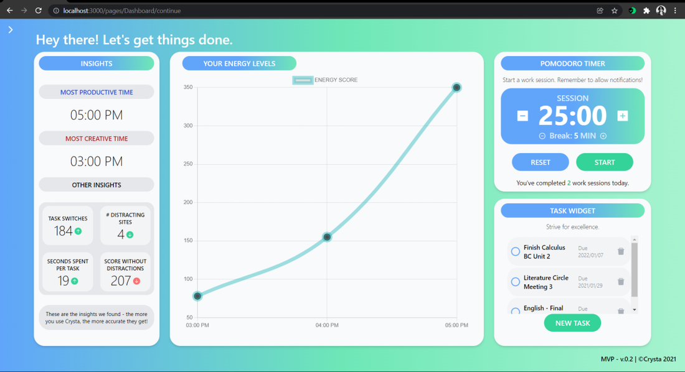
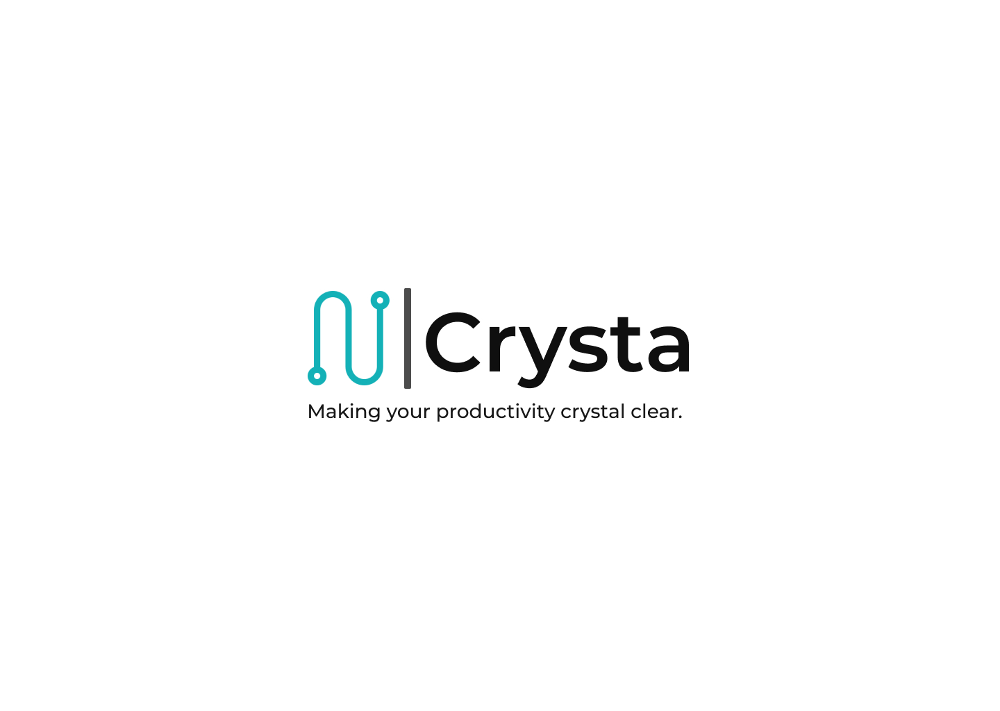

# 🤖 Crysta - Strive for Excellence.
Hey there! This is the code for a company I was building  for the last six months :D 

# 🤔 About...

🎯**The aim of Crysta was to help decrease student procrastination by tracking their energy levels.** Basically, Crysta would track various different metrics throughout the day – things like the number of distracting sites visited, the number of task switches, and the amount of time spent per task – and then, using an **algorithm** (the data_handler.py file under the flask branch), compile all these metrics into a single number known as an **energy score**. 

🔍Crysta would then look at how these scores changed throughout the day to help determine **when you were most likely to be productive, and when you were most likely to be creative**. Later on, I even integrated some features that would make it easier to work – such as a tasks list and a pomodoro timer. 

💡The original idea for the company came after reading Chris Bailey’s **Hyperfocus**, a book I’ve talked about in a couple other of my videos. As the author puts it, we each have a unique **Biological** **Prime** **time** – where we’re most productive and energetic. Similarly, we also have a time where we’re least energetic, but more creative. **Crysta aimed to be a solution that would measure your energy levels** – your biological prime time - **and then personalize your daily schedule around these findings** Theoretically, this would mean **significantly** **higher** **productivity** for the end user. 

You can find out more (**and use Crysta yourself**) at our website: https://tinyurl.com/Crysta-MVP

While the company itself didn't take off, I learned a LOT through the experience. Here's a quick article with all the insights, lessons, and frameworks I've aquired through thiis venture - and, specific action items to avoid future mistakes. https://aditya-dewan124.medium.com/my-first-company-failed-heres-what-i-learned-and-what-you-should-avoid-5174ee78481a

Here's a quick, 3min video talking about this!
https://www.loom.com/share/8003c48133cb47aa9fc4b43e359eb036

# ⚙️ How it works!

There are 2 parts to Crysta: 

1. 🌐A **webapp** - made with the MERN stack (MongoDB, Express, React, and Node.js) and deployed on Heroku (link on the website)
2. ⚡A desktop **energy** **tracker** - an API made with Python and Flask that starts a local server and feeds the energy levels into the webapp.

Few people have tried tracking someone's energy levels directly from their desktop activity. But, after reaching out to some professors - namely, Piers Steel Peter Gröpel, the writers of a mega-trial responsible for finding procrastination factors - I decided to make this happen. Once we had enough data, **the idea was to apply Artifical Intelligence (MLPs)** to more accurately determine this. (here's the paper the two professors wrote:(https://www.researchgate.net/publication/222569814_A_mega-trial_investigation_of_goal_setting_interest_enhancement_and_energy_on_procrastination)

What made this app particularly challenging to build, especially for a first-time web-developer like me, was that the **webapp had to communicate with desktop app**. Crysta’s desktop app is what collected the necessary data, like task-switches and distracting sites, to generate an energy score – which then was posted to the database. **The idea was that, the desktop app (which was made with Python and Flask) would start tracking your energy levels the second you logged into the webapp** – meaning that there had to be repeated communication going on between the two apps. **So, to accomplish this, I learned the ins-and-outs of APIs, requests, servers, and how all of these different pieces work and come together to create a good user experience. **

On the other hand, working on features like the pomodoro timer and the task manager also taught me the basics of database management and storage using the **CRUD** (create, read, update, and delete) method, as well as MongoDB queries and best practices.

**All in all, this repo is almost 100 thousand lines of total code (and 1.7k+ lines of written code)!**

# 📚 A Guide to this Repo (Usage)

There are three branches:
1. staging (this is the main branch -> where all new features were pushed) - this version can be found at https://crysta-staging.herokuapp.com/
2. flask_energy_tracker (the code for the Python/Flask API + the energy algorithm) - this can be found at https://drive.google.com/file/d/1d1Fw2UBuvYmu9M9CJrHf_iRkNXMUVO6p/view?usp=drivesdk
3. the development branch (for when features have been tested and deemed good for production https://crysta-app.herokuapp.com/

**This project was AWESOME - from designing the figma mockups to coding for days on end, I wouldn't have traded this for anything else.**

Thanks for reading! I hope this will be useful for a LOT of people (and advancing research).

